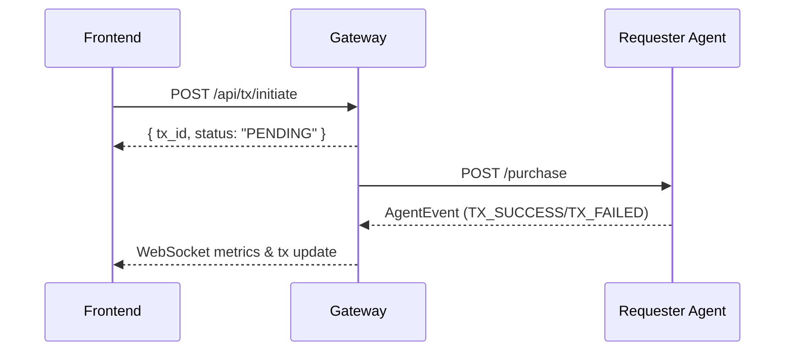

# Frontend Integration

## Transaction Sequence



## Sample Agent Event

```json
{
  "type": "TX_SUCCESS",
  "payload": {
    "tx_id": "123",
    "offer_id": "off-1",
    "provider_id": "prov-1",
    "amount": 3.1,
    "tx_hash": "0xDUMMY"
  }
}
```

